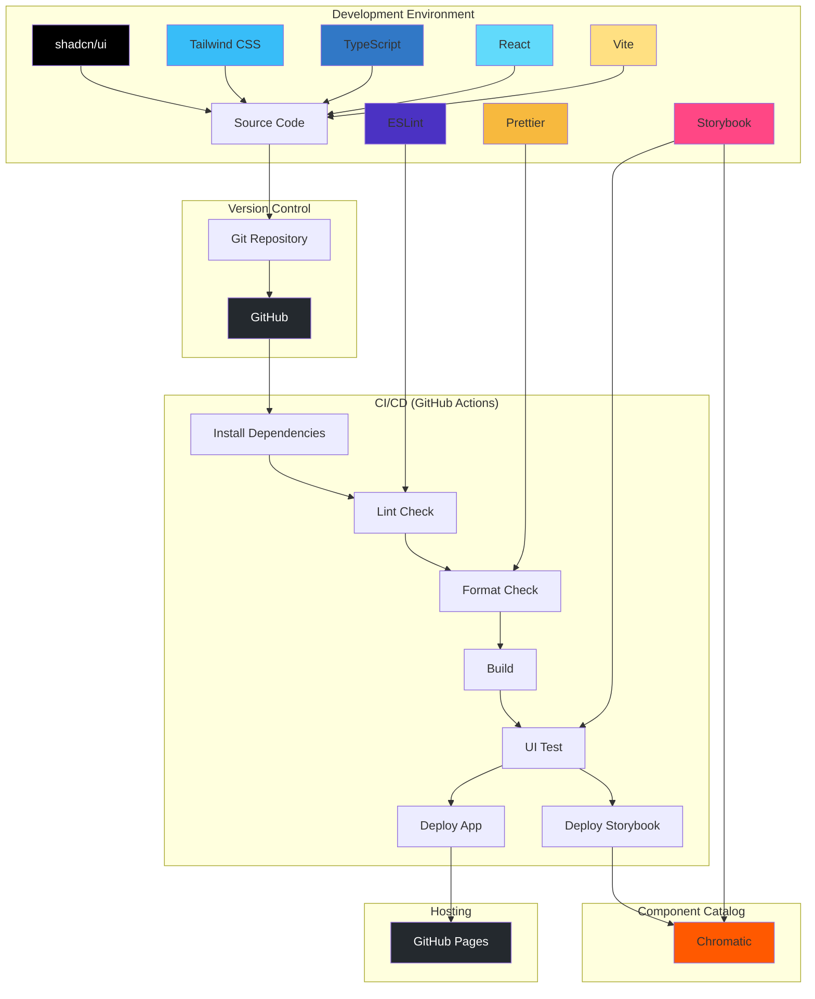

# System Architecture

```mermaid
flowchart TB
    subgraph "Development Environment"
        code[Source Code]
        vite[Vite]
        react[React]
        ts[TypeScript]
        tailwind[Tailwind CSS]
        shadcn[shadcn/ui]
        eslint[ESLint]
        prettier[Prettier]
        storybook[Storybook]
    end

    subgraph "Component Catalog"
        chromatic[Chromatic]
    end

    subgraph "Version Control"
        git[Git Repository]
        github[GitHub]
    end

    subgraph "CI/CD (GitHub Actions)"
        direction TB
        install[Install Dependencies]
        lint[Lint Check]
        format[Format Check]
        build[Build]
        ui_test[UI Test]
        deploy_storybook[Deploy Storybook]
        deploy_app[Deploy App]
    end

    subgraph "Hosting"
        pages[GitHub Pages]
    end

    code --> git
    git --> github

    vite --> code
    react --> code
    ts --> code
    tailwind --> code
    shadcn --> code

    eslint --> lint
    prettier --> format
    storybook --> ui_test

    github --> install
    install --> lint
    lint --> format
    format --> build
    build --> ui_test
    ui_test --> deploy_storybook
    ui_test --> deploy_app

    storybook --> chromatic
    deploy_storybook --> chromatic

    deploy_app --> pages

    style vite fill:#FFE082
    style react fill:#61DAFB
    style ts fill:#3178C6
    style tailwind fill:#38BDF8
    style shadcn fill:#000000,color:#FFFFFF
    style eslint fill:#4B32C3
    style prettier fill:#F7B93E
    style storybook fill:#FF4785
    style chromatic fill:#FF5900
    style github fill:#24292E,color:#FFFFFF
    style pages fill:#24292E,color:#FFFFFF

```
